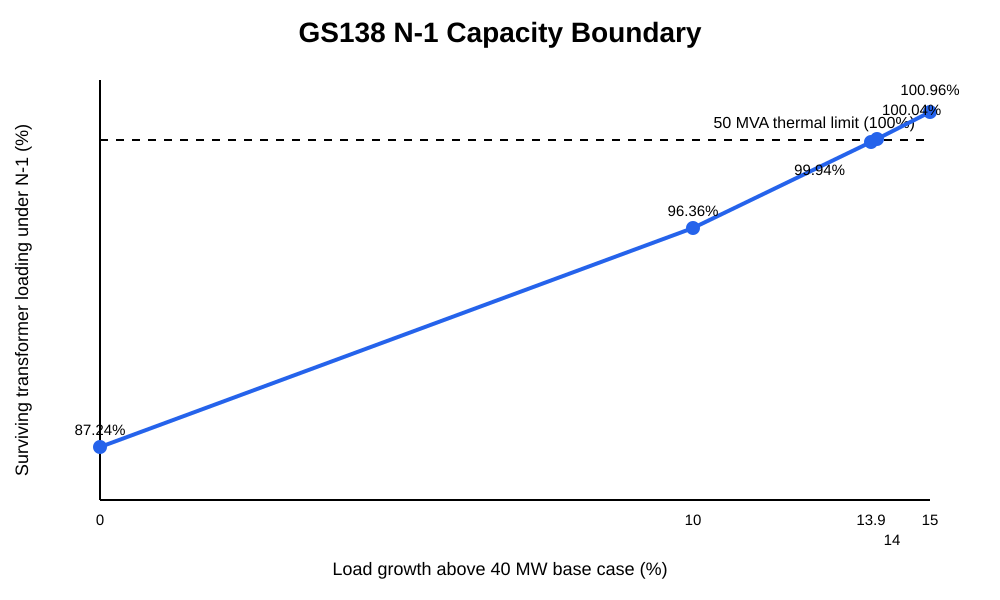

# 138/34.5-kV Substation Load Flow, N-1 Contingency, and Capacity Analysis

**Author:** Hassan Ahmed Mohammad  
**Study type:** Conceptual portfolio / academic engineering study  
**Primary tool:** PowerWorld Simulator

## Project objective

Develop a conceptual 138/34.5-kV two-transformer substation model and evaluate its performance under normal operation, single-transformer contingencies, corrective bus-transfer operation, and future load growth. The study focuses on transformer utilization, continuity of service, voltage performance, and the approximate N-1 capacity boundary.

## System configuration

- Two 138/34.5-kV transformers, **50 MVA each**.
- Two 34.5-kV bus sections: **Bus A** and **Bus B**.
- Normally open 34.5-kV bus tie.
- Six equal constant-power loads at the base case, each approximately **6.667 MW / 2.191 Mvar**.
- Base station load: **40.00 MW / 13.15 Mvar**, approximately **0.95 power factor**.
- Normal operation: both transformers in service, bus tie open.
- N-1 corrective state: one transformer out, bus tie closed so the surviving transformer supplies both bus sections.

## Key results

| Study case | Total load | N-1 transformer loading | Post-contingency voltage | Thermal result |
|---|---:|---:|---:|---|
| Base | 40.00 MW | 87.24% | 0.96529 pu | PASS |
| +10% | 44.00 MW | 96.36% | - | PASS |
| +13.9% | 45.56 MW | 99.94% | 0.95967 pu | PASS - boundary |
| +14.0% | 45.60 MW | 100.04% | - | FAIL |
| +15.0% | 46.00 MW | 100.96% | - | FAIL |

The modeled N-1 thermal boundary is approximately **45.6 MW**, or about **14% above the 40 MW base load**. At +13.9% growth, the surviving transformer carries approximately **49.97 MVA (99.94%)** and the 34.5-kV bus voltage is approximately **0.95967 pu**. In this simplified model, transformer thermal capacity becomes limiting before the selected **0.95 pu** voltage criterion is reached.

## Base case

At 40 MW total station load, each transformer operates at approximately **42.80%** loading and the 34.5-kV buses are approximately **0.9838 pu**.

## N-1 contingency method

Two symmetrical contingencies were evaluated:

1. `T1_Out_TIE_CLOSE`: open T1 and close the Bus A-B tie.
2. `T2_Out_TIE_CLOSE`: open T2 and close the Bus A-B tie.

At the base load, either contingency raises the surviving transformer to **87.24%** loading while maintaining service to both bus sections.

## Repository contents

See the `docs/`, `figures/`, `results/`, and `analysis/` folders for the report, project brief, visual evidence, structured results, and plotting script.

## Reproducing the study

1. Solve the normal topology with T1 and T2 closed and the Bus A-B tie open.
2. Confirm the 40 MW base load and approximately 42.8% transformer loading.
3. Define T1-out and T2-out contingencies with corrective closure of the normally open bus tie.
4. Run AC contingency analysis and record surviving-transformer `%MVA`.
5. Scale Bus A and Bus B loads while maintaining constant P/Q ratio.
6. Repeat the two contingencies at each growth level.
7. Identify the point where the surviving transformer crosses 100% of its 50-MVA rating.
8. Verify post-contingency bus voltage near the capacity boundary.

## Scope and limitations

This is a **conceptual portfolio study**, not an issued-for-construction design. It does not include short-circuit duty, protection coordination, relay settings, grounding, arc-flash, insulation coordination, detailed equipment specifications, physical layout, structural design, cable ampacity, dynamic stability, or an implemented/verified automatic transfer scheme. The **0.95 pu** voltage value is used as a study criterion here and is not presented as a utility-specific standard.

The contingency action includes closing the normally open bus tie after a transformer outage. That represents a modeled corrective switching state; it should not be interpreted as proof of automatic transfer logic, protection interlocking, or switching-time performance.

## Engineering takeaway

The base 40 MW condition has substantial N-1 headroom, but the margin decreases quickly with load growth. The model reaches its transformer thermal boundary at approximately 45.6 MW. This demonstrates how load flow, N-1 contingency analysis, and scenario scaling can be combined to support substation capacity planning.

## Downloadable source files

The repository includes text-native documentation and result data. Original PowerWorld binary files, the AutoCAD-exported conceptual SLD PDF, detailed screenshots, and PDF/DOCX reports are listed in the repository manifests and can be added through GitHub's web upload interface when binary upload is needed.

See:
- [PowerWorld model manifest](models/README.md)
- [Model checksums](models/SHA256SUMS.txt)
- [Conceptual SLD notes](drawings/README.md)
- [Technical report (Markdown)](docs/GS138_Substation_Technical_Report.md)
- [Project brief (Markdown)](docs/GS138_LinkedIn_Project_Brief.md)
